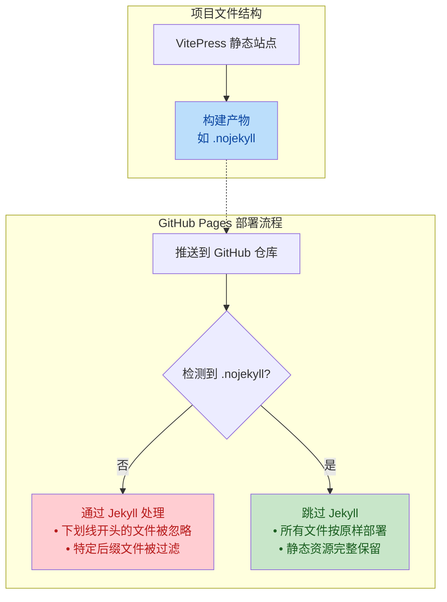

# .nojekyll 文件分析

## 1. 高层概要 (TL;DR)

*   **影响范围:** 🟢 **低** - 这是一个简单的配置文件添加，不会影响代码逻辑
*   **核心变更:** 添加了 `.nojekyll` 文件，用于优化 **GitHub Pages** 的静态文件部署

### 关键变更点
- ✅ **新增** `.nojekyll` 空文件，指示 GitHub Pages **跳过 Jekyll 处理流程**
- 📦 **目标:** 确保静态资源（如 `tsconfig.json`、`favicon` 等）被正确部署，不会被 Jekyll 过滤或忽略

---

## 2. 视觉化概览 (代码与逻辑映射)



### 流程说明

| 阶段 | 无 `.nojekyll` | 有 `.nojekyll` |
|------|----------------|----------------|
| **GitHub Pages 处理** | 通过 Jekyll 构建引擎处理 | 跳过 Jekyll，直接部署原始文件 |
| **下划线开头文件** | ❌ 被忽略（如 `_assets`） | ✅ 正常保留 |
| **特殊后缀文件** | ❌ 可能被过滤（如 `.xml`） | ✅ 完整保留 |
| **最终部署内容** | 可能丢失部分静态资源 | 所有文件原样部署 |

---

## 3. 详细变更分析

### 📁 配置文件变更

**文件名:** `.nojekyll`  
**变更类型:** ✨ 新增文件  
**文件状态:** 空文件（无内容）

#### 为什么需要这个文件？

1. **GitHub Pages 默认行为**
   - GitHub Pages 默认使用 Jekyll（静态站点生成器）处理所有文件
   - Jekyll 有特定的文件过滤规则，可能与 VitePress 生成的文件冲突

2. **VitePress 特殊文件**
   - VitePress 生成的文件包含下划线开头的文件（如 `_assets` 目录）
   - 包含某些配置文件（如 `tsconfig.json`）可能被 Jekyll 错误处理
   - 这些文件在 Jekyll 处理中会被忽略，导致站点功能异常

3. **解决方案**
   - 添加 `.nojekyll` 文件显式告诉 GitHub Pages 跳过 Jekyll
   - 确保所有 VitePress 构建产物按原样部署

#### 适用场景对比

| 场景 | 需要 `.nojekyll` | 不需要 `.nojekyll` |
|------|------------------|-------------------|
| VitePress 静态站点部署到 GitHub Pages | ✅ 需要 | ❌ |
| 使用 Jekyll 作为静态站点生成器 | ❌ 不需要 | ✅ 需要 |
| 纯 HTML/CSS/JS 站点 | ⚠️ 可选（但建议添加） | - |
| Next.js / Nuxt.js / SSG 构建产物 | ✅ 需要 | - |

---

## 4. 影响与风险评估

### ✅ 无风险变更

**风险评估:** 🟢 **零风险**
- 此变更仅影响部署流程，不影响代码逻辑
- 空文件不会引入任何运行时错误
- 向后兼容，不会破坏现有功能

### ⚠️ 潜在注意事项

| 风险项 | 描述 | 缓解措施 |
|--------|------|----------|
| 部署环境变更 | 如果改用其他托管平台（如 Vercel、Netlify），此文件无效 | 这些平台本身不使用 Jekyll，无影响 |
| 团队协作 | 团队成员可能不理解此文件用途 | 在项目 README 中添加说明 |

### 🧪 测试建议

1. **部署验证**
   ```bash
   # 提交并推送到 GitHub 后，验证以下内容：
   # 1. 检查 GitHub Pages 部署状态是否成功
   # 2. 访问站点，确认所有静态资源正常加载
   # 3. 检查浏览器控制台，确认无 404 错误
   ```

2. **文件完整性检查**
   - 确认下划线开头的目录（如 `_assets`）可正常访问
   - 确认配置文件（如 `tsconfig.json`）未被过滤

3. **回滚测试**
   - 如果意外删除 `.nojekyll` 文件，站点是否会出现问题（建议保留此文件）

---

## 5. 最佳实践建议

### 📋 项目维护清单

- [x] **已添加** `.nojekyll` 文件
- [ ] 在 `README.md` 中添加说明：解释为何需要此文件
- [ ] 在 CI/CD 流程中验证构建产物包含 `.nojekyll`
- [ ] 定期检查 GitHub Pages 部署日志，确认无 Jekyll 处理警告

### 📚 参考资源

- [GitHub Pages 官方文档 - 关于 .nojekyll](https://docs.github.com/en/pages/getting-started-with-github-pages/about-github-pages#static-site-generators)
- [Jekyll 官方文档 - 文件过滤规则](https://jekyllrb.com/docs/static-files/)